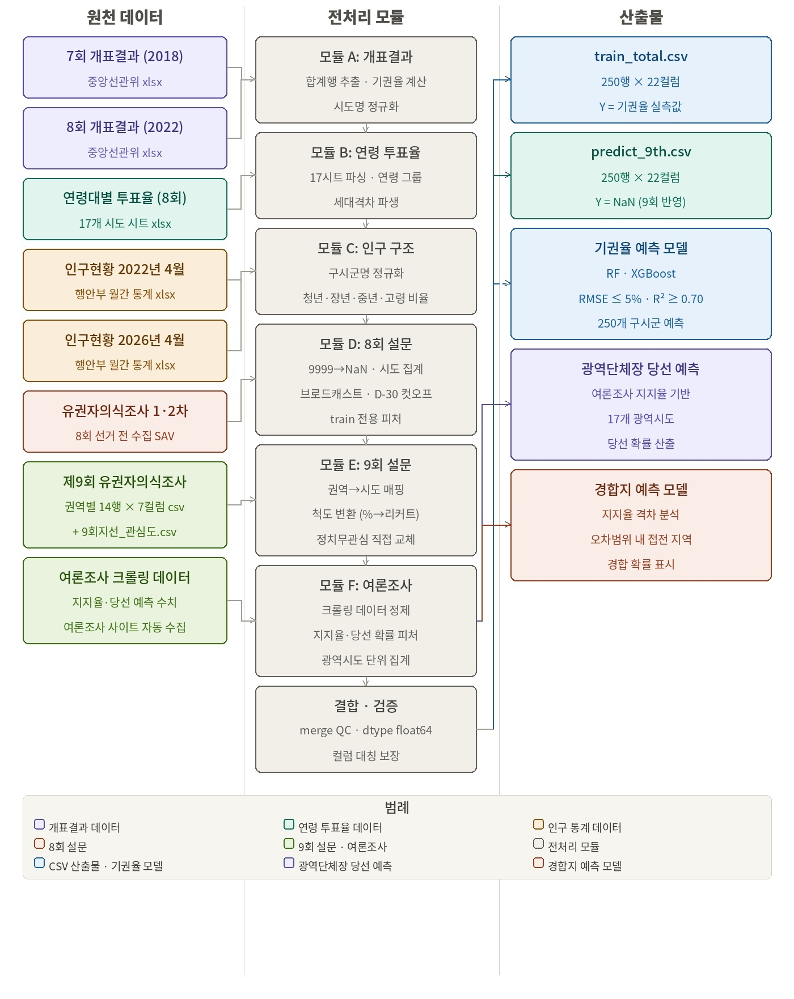

# SKN31-2nd-1Team
<div align="center">
    </td>


## 팀 및 팀원 소개

# 유권자들


| 김동민 | 김재원 | 박하린 | 안혁진 | 전서연 
| :---: | :---: | :---: | :---: | :---: |
| <a href="https://github.com/Uranium10"> | <a href="https://github.com/kimjae9360"> | <a href="https://github.com/MintRinne"> | <a href="https://github.com/Jinxxxok"> |  <a href="https://github.com/sxoxyn"> |
| |  |  |  |  |
| <b>PM</b>     |<b>데이터 전처리</b>  |<b>데이터 전처리</b>   |<b>ML/DL</b>  | <b>ML/DL</b>   | | 

</div>
---


## 프로젝트 개요

### 프로젝트명
제9회 지방선거 시군구별 투표 이탈(기권) 예측


### 프로젝트 소개
과거 지방선거에는 참여했으나, 이번 제9회 지방선거에서는 투표에 참여하지 않고 이탈(기권)할 가능성이 높은 지역을 예측한다. 
공간 데이터와 유권자 인구 특성을 결합하여 '기권 위험 지도'를 구축하는 것을 핵심으로 한다.

### 프로젝트 배경
- 지방선거의 고질적인 낮은 참여율  
 : 지방선거는 대선이나 총선에 비해 상대적으로 유권자의 관심도가 낮아, 투표율 제고를 위한 선제적 조치가 절차적으로 중요하다.
- 마케팅 개념의 공공 부문 도입  
 : 기업이 이탈 징후가 보이는 고객을 데이터로 식별하고 타겟 마케팅을 펼치듯, 
 유권자 데이터 분석을 통해 투표 참여율이 급감할 유력 지역을 미리 찾아낸다.
- 한정된 자원의 효율적 배분  
 : 선거관리위원회의 투표 독려 예산이나 정당의 캠페인 인력 등은 한정되어 있다. 따라서 무차별적인 홍보 대신, 
 데이터 기반의 이탈 위험 지역을 정의함으로써 최소한의 비용으로 유권자 이탈을 막는 효율적인 자원 투입이 필요하다.


### 프로젝트 목표
- 유권자 이탈 예측 모델 개발 및 고도화  
 : 과거 선거 데이터(투표율 변동 추이), 인구 통계 데이터(연령)를 융합한 머신러닝 기반의 이탈 위험 예측 모델을 구축한다.
- 데이터 기반의 투표 이탈 위험 지도 시각화   
 : 분석 결과를 GIS(지리정보시스템)와 결합하여, 한눈에 이탈 위험도를 파악할 수 있는 대시보드 및 지도를 제작한다.
- 실효성 있는 타겟형 투표 독려 전략 제시  
 : 이탈 위험이 높게 예측된 지역을 중심으로 '찾아가는 사전투표소 운영', '선거 공보물 가독성 개선', 
 '취약 지역 집중 가로수 현수막 및 모바일 알림톡 발송' 등의 맞춤형 행정 서비스를 제안한다.

### 프로젝트 구조

```
📂  root
├ 📄 README.md
├ 📄 .gitignore
┃
├ 📂 data
┃├ 📂 processed  # 가공 후 데이터
┃├ 📂 raw  # 가공 전 데이터
┃└ 📄 preprocess.py   # 프로그램
├ 📂 DL  # 당선 예측 모델
├ 📂 image
├📂 ML
┃├ 📂 notebooks # 주피터
┃├ 📂 models  # 저장된 모델
┃└ 📄 requirements.txt  # 필요패키지 
├📂 web_back
├📂 web_front
├📂 산출물
```
---

## 기술 스택

### Frontend
<span>
 


</span>

### Backend 
<span>
 
</span>

### Data Processing & Analysis
<span>
 
 

</span>

### Web Scraping
<span>

</span>

---

## 데이터 파이프라인

<span>자료 : <a href="https://www.notion.so/Feature-370db08ed97780edae09d6fc808a846d?source=copy_link" rel="noreferrer noopener" target="_blank">Notion - Feature명세서</a></span>


## 요구사항 명세

### FR-1 · 데이터 전처리
| ID | 요구사항 | 담당 | 산출물 |
|---|---|---|---|
| D01 | 7,8회 개표결과 로드 및 기권율 계산, 시도명 정규화 | 하린,재원 | 구시군별 기권율 테이블 |
| D02 | 연령대별 투표율 파싱 → 청년/장년/중년/고령 파생변수 생성 | 하린,재원 | 연령그룹별 투표율 피처 |
| D03 | 2022,2026 인구 파일 파싱 및 비율 산출, 지명 불일치 33건 매핑 | 하린,재원 | 인구비율 4개 피처 |
| D04 | 8회 SAV 설문 집계 → 구시군 브로드캐스트 | 재원 | train 설문 피처 |
| D05 | 9회 의식조사 권역→시도 매핑, % → 리커트 척도 변환 | 하린 | predict 설문 피처 |
| D06 | 2026 여론조사(지선,대선/정당 지지율) 크롤링 수집 | 혁진 | 지지율 CSV 다수 |
| D07 | train 250행,결측 0건 / predict 250행,컬럼 대칭 최종 검증 | 하린,재원 | `train_total.csv` `predict_9th.csv` |

### FR-2 · ML/DL 모델링
| ID | 요구사항 | 담당 | 산출물 |
|---|---|---|---|
| M01 | 피처별 분포·상관관계 EDA | 혁진,서연 | EDA 리포트 |
| M02 | Ridge 베이스라인 학습, Leakage 피처 제거 | 혁진,서연 | RMSE·R² 결과 |
| M03 | LOO 교차검증 (LR & MLP) | 혁진,서연 | LOO 정확도 |
| M04 | Lasso·LightGBM 주 모델 학습 및 비교 | 혁진,서연 | 모델 객체 |
| M05 | MLP+LR 경합지역 당락 예측 (DL) | 혁진,서연 | MLP+LR 모델 |
| M06 | SHAP 피처 중요도 분석 | 혁진,서연 | SHAP 차트 |
| M07 | `predict_9th.csv` 입력 → 9회 기권율 예측, 모델 저장 | 혁진,서연 | `predict_9th_result.csv` `model_final.pth` |

### FR-3 · 웹 대시보드
| ID | 요구사항 | 담당 | 산출물 |
|---|---|---|---|
| W01 | 시군구별 기권율 React-rechart lib 지도 구현 | 동민 | 지도 컴포넌트 |
| W02 | 기권율 49.5% 컷오프 기준 고위험 지역 경고 팝업 | 동민 | 경고 팝업 컴포넌트 |
| W03 | 광역시단체장 당선 예측, 경합 지역 chart 구현 | 동민 | 바차트 컴포넌트 |
| W04 | 배포 | 동민 | 배포 URL |

### NFR · 비기능 요구사항
- **정확도** : 기권율 예측 RMSE ≤ 3.0%p, R² ≥ 0.70
- **완결성** : train/predict 데이터셋 결측값 0건, 전국 250개 구시군 커버리지 100%
- **성능** : 대시보드 초기 로딩 5초 이내
- **유지보수** : 모듈별 독립 실행 가능하도록 코드 분리, Feature 명세서(Notion) 갱신 및 GitHub 버전관리, 데일리 스탠드업 전 기간 운영

---

## 주요 프로시저
### 1. 주요 함수


---

## 수행 결과
### 1) 메인 페이지 


### 2) 


### 3)


### 4) 


### 5)


### 6) 


## 한 줄 회고
#### 김동민
 - 

#### 김재원
 - 

#### 박하린
 - 

#### 안혁진
 - 
 
#### 전서연
 - 
