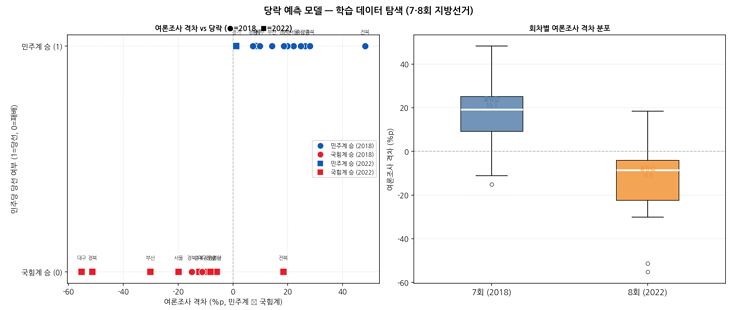
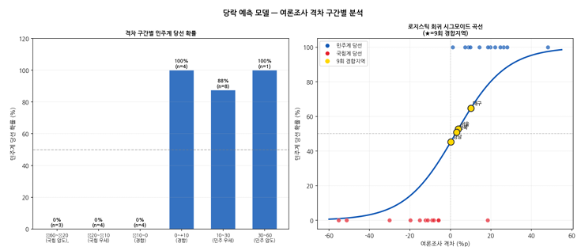

# EDA 리포트
## 피처별 분포 및 상관관계 탐색 — 경합지역 당락 예측 DL

## 1. 데이터 개요

### 1-1. 분석 대상

7·8회 지방선거 광역단체장 선거 결과를 기반으로 구성된 학습 데이터를 대상으로 EDA를 수행하였다.

| 항목 | 내용 |
|:-:|:-:|
| 데이터 출처 | 선관위 7·8회 지방선거 개표 결과 + 선거 전 여론조사 |
| 분석 단위 | 시·도 광역단체장 선거(회차별) |
| 샘플 수 | 24개(7회 12개 + 8회 12개) |
| 피처 | poll_gap : 여론조사 격차(민주계 - 국힘계, 단위 : %p) |
| 타겟 | 민주당승(1=민주계 당선, 0=국힘계 당선) |
| 클래스 균형 | 민주계 12개 / 국힘계 12개(완전 균형) |

### 1-2. 피처 구성

당락 예측 모델은 소규모 데이터(24개)의 과적합 방지를 위해 단일 피처를 사용한다.

| 피처명 | 정의 | 산출 방법 |
|:-:|:-:|:-:|
| poll_gap | 여론조사 격차(%p) | 민주계 후보 지지율 - 국힘계 후보 지지율(%p) |

---

## 2. 기술통계

| 구분 | 평균 | 표준편차 | 최솟값 | 25% | 중앙값 | 75% | 최댓값 |
|:-:|:-:|:-:|:-:|:-:|:-:|:-:|:-:|
| 전체(24개) | +0.98 | 24.75 | -55.2 | -11.5 | +4.3 | +18.8 | +48.2 |
| 7회(2018, 12개) | +17.2 | 17.9 | -15.1 | +8.5 | +18.5 | +25.9 | +48.2 |
| 8회(2022, 12개) | -15.2 | 19.8 | -55.2 | -22.3 | -9.7 | -5.9 | +8.9 |

> ※ 7회(2018): 민주계 압승 구도 — 중앙값 +18.5%p (민주계 강세)
> ※ 8회(2022): 국힘계 우세 구도 — 중앙값 -9.7%p (국힘계 강세)
> ※ 전체 중앙값 +4.3%p로 두 회차 균형 분포

**경합 지역 현황**

| 경합 기준 | 경합 지역 수 | 비율 | 해당 지역 |
|:-:|:-:|:-:|:-:|
| 격차 절댓값 5%p 이내 | 4개 | 16.7% | 인천2022(-5.8), 충남2022(-5.9), 경기2022(+1.2), 경남2018(+7.3) |
| 격차 절댓값 10%p 이내 | 8개 | 33.3% | 위 4개 + 강원2022(-9.1), 경남2022(-8.2), 제주(2개) |

---

## 3. 피처 분포 및 당락 관계 탐색

아래 그림은 여론조사 격차와 당락의 관계 및 회차별 분포를 나타낸다.

_[그림 1] 여론조사 격차 vs 당락 산점도 및 회차별 격차 분포 (●=7회/2018, ■=8회/2022)_

### 3-1. 분포 특성

- **격차 분포** : 전체적으로 양봉 형태 — 7회(양수, 민주 강세)와 8회(음수, 국힘 강세) 뚜렷한 이분화
- **극단값** : 대구 2022(-55.2%p), 전북 2018(+48.2%p) — 전통적 지역 텃밭 효과
- **경합 구간(±10%p)** : 8개 샘플이 해당 — 모델 예측 난이도 집중 구간

### 3-2. 격차와 당락의 관계

- **격차 > 0(민주 우세)인 경우** : 9개 중 8개 민주계 당선(88.9%)
- **격차 < 0(국힘 우세)인 경우** : 15개 중 4개 민주계 당선(26.7%) — 여론조사 역전 사례 존재
- **격차 ±10%p 초과 구간** : 대부분 여론조사 방향 그대로 당선 확인

---

## 4. 격차 구간별 당선 확률 및 모델 적합

아래 그림은 격차 구간별 민주계 당선 확률과 LR 시그모이드 곡선을 나타낸다.

_[그림 2] 격차 구간별 민주계 당선 확률 및 LR 시그모이드 곡선 (★=9회 경합지역)_

### 4-1. 구간별 당선 확률

| 격차 구간 | 샘플 수 | 민주계 당선률 | 해석 |
|:-:|:-:|:-:|:-:|
| -60 ~ -20%p (국힘 압도) | 5개 | 0% | 모든 샘플 국힘계 당선 |
| -20 ~ -10%p (국힘 우세) | 4개 | 25% | 여론조사 역전 1건 |
| -10 ~ 0%p (경합) | 4개 | 25% | 경합 구간 — 예측 어려움 |
| 0 ~ +10%p (경합) | 4개 | 75% | 경합 구간 — 민주 소폭 우세 |
| +10 ~ +30%p (민주 우세) | 4개 | 100% | 모든 샘플 민주계 당선 |
| +30 ~ +60%p (민주 압도) | 3개 | 100% | 모든 샘플 민주계 당선 |

### 4-2. 로지스틱 회귀 적합 및 9회 경합지역

- **LR 시그모이드 곡선** : 격차 0%p 근방에서 확률 50% 교차 — 직관적 해석 가능
- **9회 경합 4개 지역** : 모두 격차 +0.2~+10.1%p(민주 소폭 우세) 구간에 위치
- **경남(+0.2%p)** : 50% 경계선에 가장 근접 — 초경합 지역으로 예측 불확실성 가장 높음

---

## 5. EDA 결론 및 모델링 시사점

| 시사점 | 근거 |
|:-:|:-:|
| 단일 피처(poll_gap)로 충분한 예측력 | 격차 ±10%p 초과 시 당락이 대부분 여론조사 방향과 일치 |
| 경합 구간(±10%p)이 모델 핵심 도전 | 격차 절댓값 10%p 이내에서 역전 사례 다수 — 오분류 주 발생 구간 |
| 소규모 데이터 한계 명확 | 24개 샘플 → 과적합 위험, LOO-CV 필수, 추가 피처 시 과적합 심화 |
| 회차별 정치 구도 차이 중요 | 7회(민주 압승) vs 8회(국힘 우세) — 정치 환경 변수 미반영 한계 |
| 확률 보정(Platt Scaling) 필요 | 소규모 MLP의 경합 구간 확률이 극단값으로 쏠리는 경향 있음 |

---
