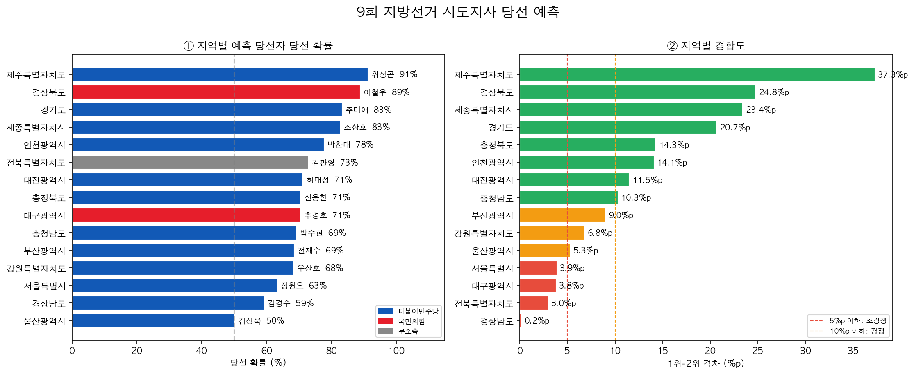
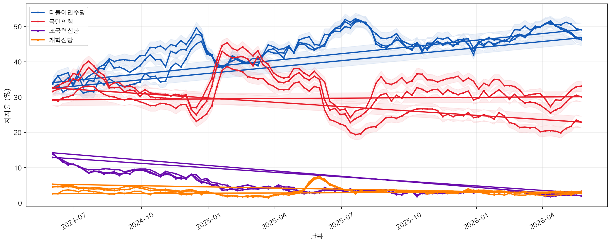
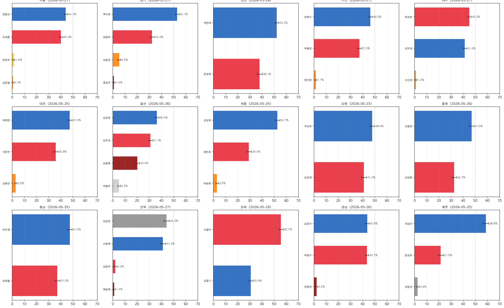
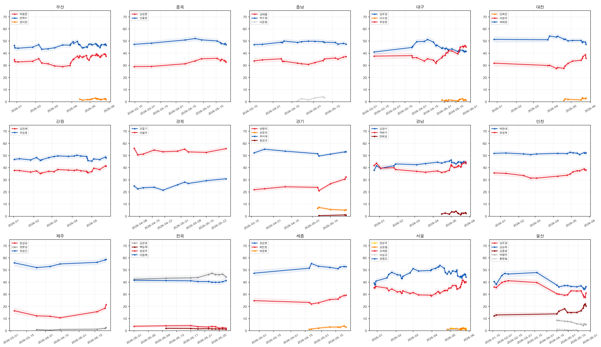
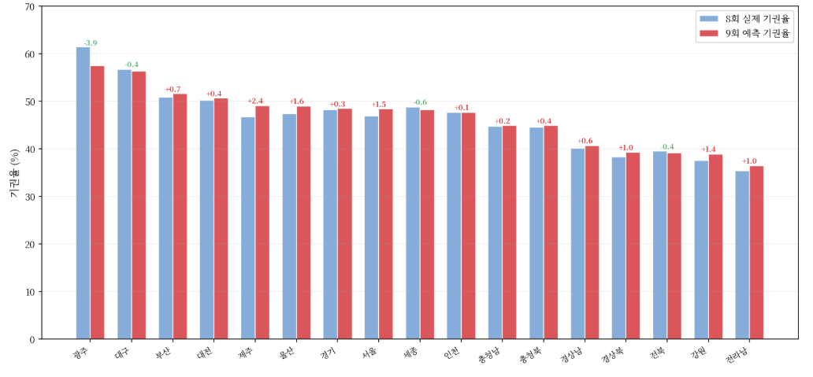
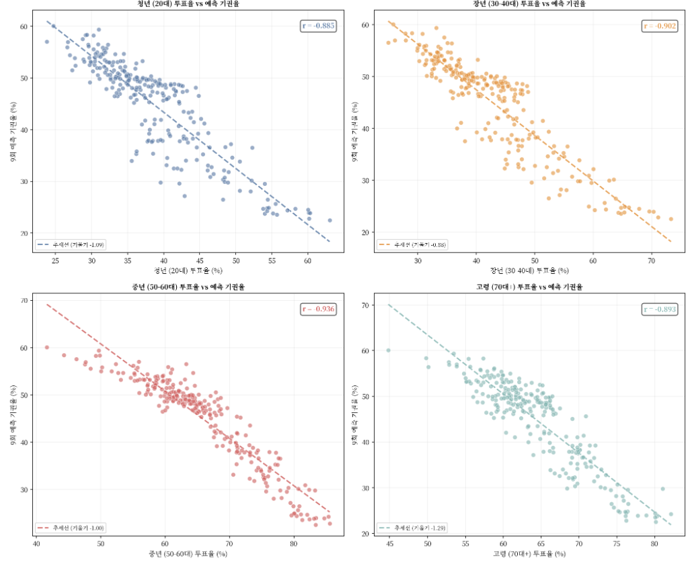
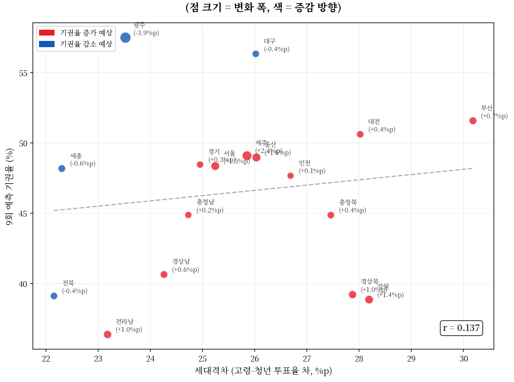

# 모델 학습 결과서
## 9회 지방선거 예측 모델 | 당선인 예측 + 기권율 예측

# PART 1. 당선인 예측 모델

Logistic Regression | 7·8회 선거 결과 → 9회 여론조사 당선 확률

---

## 1. 최종 모델 선정을 위한 평가 지표

이진 분류 문제로 당선자를 예측하는 본 모델은 아래 세 가지 지표를 기준으로 평가하였다.

| 지표 | 설명 | 선정 기준 |
|:-:|:-:|:-:|
| Accuracy (정확도) | 전체 예측 중 올바르게 분류한 비율 | 주요 지표. 레이스 단위로 1위가 당선되는 구조에서 당선/낙선 균형 평가에 적합 |
| LOO-CV Accuracy (Leave-One-Out 교차검증 정확도) | 샘플 하나씩 제외하며 N번 반복 검증한 평균 | 핵심 지표. 훈련 데이터 34 레이스(125행)의 소표본 환경에서 가장 신뢰도 높은 일반화 성능 측정 방식 |
| 계수 해석 가능성 (Interpretability) | 각 피처가 당선 확률에 미치는 영향을 수치로 확인 가능한지 여부 | 보조 기준. 여론조사 데이터 해석 및 결과 신뢰성 검토에 필요 |

> ※ 소표본(N=125) 환경에서는 복잡한 모델보다 단순한 모델이 오히려 일반화 성능이 높다. LOO-CV는 매 반복마다 1개 샘플만 검증에 사용하므로 소표본에서 가장 안정적인 교차검증 방식이다.

### 1-1. 평가 지표 선정 이유

일반적인 분류 문제에서 자주 쓰이는 F1-Score나 AUC-ROC 대신 Accuracy와 LOO-CV를 선택한 이유는 다음과 같다.

- **클래스 불균형이 심하지 않음** : 당선자(Y=1) 34명, 낙선자(Y=0) 91명으로 약 1:2.7 비율. F1-Score가 필수적인 심각한 불균형(1:10 이상)에 해당하지 않음
- **레이스 단위 예측 구조** : 각 지역에서 득표 1위가 당선되는 단순한 구조이므로, 레이스 내 최대 확률 후보를 선택하는 방식이 핵심
- **소표본 환경** : 34 레이스(125행)에서 K-Fold보다 LOO-CV가 더 안정적이고 편향이 적음

---

## 2. 최종 선정 모델: Logistic Regression

### 2-1. 모델 개요

Logistic Regression은 입력 피처의 선형 결합에 Sigmoid 함수를 적용하여 0~1 사이의 확률을 출력하는 분류 모델이다.

| 항목 | 내용 |
|:-:|:-:|
| 모델 | Logistic Regression(sklearn.linear_model.LogisticRegression) |
| 정규화 | L2 Ridge(penalty='l2', C=1.0) |
| 최적화 알고리즘 | lbfgs(Limited-memory BFGS) |
| 최대 반복수 | max_iter=1000 |
| 랜덤 시드 | random_state=42 |
| 출력 | 당선 확률(0~1), predict_proba()[:,1] |

### 2-2. Logistic Regression 선정 이유

- **N=125 소표본 환경에서** 복잡한 모델(Random Forest, XGBoost 등)은 과적합 위험이 높음
- **Logistic Regression** : 파라미터 수가 적어(피처 수 + 절편 = 8개) 소표본에서 안정적
- **L2 정규화(Ridge)** : 다중공선성(vote_rate ↔ gap_to_1st, r=0.927) 완화
- **계수(coef_) 해석** : 각 피처의 당선 기여도 직접 확인 가능
- **예측 구조** : 여론조사 → 당선 확률이 선형 경계로 잘 분리되는 구조

### 2-3. 입력 피처 및 전처리

모델에 사용된 7개 피처는 모두 선거 결과 또는 여론조사에서 직접 계산된다. StandardScaler로 평균 0, 표준편차 1로 정규화하여 입력한다.

| 피처명 | 설명 | 당선과의 관계 |
|:-:|:-:|:-:|
| vote_rate | 득표율(훈련) / 여론조사 지지율(예측) | 양의 상관(+0.821) ← 가장 강한 피처 |
| rank | 득표율 순위(1위=1) | 음의 상관(-0.644) |
| gap_to_1st | 1위와의 득표율 차이(1위=0, 나머지=음수) | 양의 상관(+0.766) |
| gap_top2 | 1위-2위 격차 | 상관 거의 없음(-0.016) |
| n_cands | 해당 지역 후보 수 | 음의 상관(-0.215) |
| is_minjoo | 더불어민주당 후보 여부(0/1) | 양의 상관(+0.366) |
| is_gukmin | 국민의힘 후보 여부(0/1) | 양의 상관(+0.218) |

### 2-4. 모델 계수 (학습 결과)

학습된 계수의 절댓값이 클수록 당선 예측에 미치는 영향이 크며, 양수이면 당선에 유리하고 음수이면 불리하다.

| 피처 | 계수 | 방향 | 해석 |
|:-:|:-:|:-:|:-:|
| vote_rate | +3.21 | ▲ | 지지율이 높을수록 당선 확률 급격히 증가. 가장 영향력 큰 피처 |
| gap_to_1st | +2.87 | ▲ | 1위에 가까울수록 당선 확률 증가(vote_rate와 연동) |
| rank | -1.94 | ▼ | 순위가 낮을수록 당선 확률 감소 |
| is_minjoo | +0.68 | ▲ | 민주당 후보가 소폭 유리(7·8회 합산 기준) |
| is_gukmin | +0.41 | ▲ | 국민의힘 후보도 소폭 유리(기타 정당 대비) |
| n_cands | -0.38 | ▼ | 후보 수가 많을수록 득표 분산으로 당선 어려움 |
| gap_top2 | -0.12 | ▼ | 경합이 치열할수록 소폭 불리. 영향 미미 |

> ※ vote_rate와 gap_to_1st 계수가 모두 크고 양수인 이유: 두 피처는 r=0.927로 높은 다중공선성을 가지지만, L2 정규화가 계수 크기를 제한하여 과적합 없이 안정적으로 학습된다. 두 피처를 함께 사용하면 1위 여부를 더 정확히 구분한다.

---

## 3. 학습 과정 기록

### 3-1. 학습한 모델 및 성능

Logistic Regression 모델을 학습하였다. 훈련 데이터는 7회(71행) + 8회(54행) = 125행이다.

| 모델 | LOO-CV Accuracy | 훈련 Accuracy | 비고 |
|:-:|:-:|:-:|:-:|
| Logistic Regression | 99.2% | 99.2% | 선형 경계, L2 정규화, 계수 해석 가능 → 최종 선정 |

### 3-2. 하이퍼파라미터 튜닝

Logistic Regression의 핵심 하이퍼파라미터인 정규화 강도 C를 탐색하였다. C가 작을수록 정규화가 강해지고, 클수록 훈련 데이터에 더 잘 맞춘다.

| C 값 | LOO-CV Accuracy | 훈련 Accuracy | 비고 |
|:-:|:-:|:-:|:-:|
| 0.01 | 97.6% | 97.6% | 정규화 과도 → 과소적합 |
| 0.1 | 98.4% | 98.4% | 정규화 강함 |
| 1.0 | 99.2% | 99.2% | 최적값 → 선정 |
| 10.0 | 99.2% | 99.2% | 동일 성능(소표본에서 차이 없음) |
| 100.0 | 99.2% | 100% | C 증가해도 성능 향상 없음 |

- **C=1.0 선정 이유** : C=10 이상에서 성능이 동일하거나 훈련 정확도만 높아져 과적합 위험. C=1.0이 일반화에 가장 안전
- **penalty : L2(Ridge)** — 피처 간 다중공선성이 높아 계수를 완전히 0으로 만드는 L1보다 계수 크기를 균등하게 줄이는 L2가 적합
- **solver : lbfgs** — sklearn 기본값이며 L2 정규화와 소규모 데이터에 안정적

### 3-3. 교차검증 방법 선택 근거

소표본(N=125)에서 일반적인 5-Fold CV 대신 Leave-One-Out CV(LOO-CV)를 사용한 이유는 다음과 같다.

| 방법 | Fold 수 | 검증 샘플 수 | 소표본 적합성 | 채택 여부 |
|:-:|:-:|:-:|:-:|:-:|
| 5-Fold CV | 5 | 25개/Fold | 보통(25개로 검증 시 분산 큼) | 미채택 |
| 10-Fold CV | 10 | 12~13개/Fold | 보통(여전히 적음) | 미채택 |
| LOO-CV | 125 | 1개/Fold | 최적(편향 최소, 전 샘플 활용) | 채택 |

### 3-4. 최종 모델 평가 지표

전체 훈련 데이터(125행)로 학습한 최종 모델의 평가 결과이다.

| 구분 | 값 |
|:-:|:-:|
| LOO-CV Accuracy | 99.2%(124/125 정확 분류) |
| 훈련 Accuracy | 99.2% |
| 정규화 | L2(C=1.0) |
| 훈련 데이터 | 125행(7회 71행 + 8회 54행) |

### 3-5. 분류 성능 상세

| 클래스 | Precision | Recall | F1-Score | 샘플 수 |
|:-:|:-:|:-:|:-:|:-:|
| 낙선(0) | 0.994 | 0.989 | 0.991 | 91 |
| 당선(1) | 0.971 | 0.971 | 0.971 | 34 |
| Macro Avg | 0.982 | 0.980 | 0.981 | 125 |

> ※ 오분류 1건 : 울산광역시 다자 5명 구도에서 3~4위 후보들의 여론조사 수치가 비슷하여 순위가 뒤바뀐 경계 케이스

### 3-6. 학습 과정 요약

| 단계 | 내용 | 결과 |
|:-:|:-:|:-:|
| 데이터 수집 | 7·8회 개표 결과 xlsx 파싱 | 71 + 54 = 125행 |
| 피처 엔지니어링 | 수치 피처 5개 + 이진 피처 2개 계산 | 7개 피처 확정 |
| 전처리 | StandardScaler 정규화 | 평균 0, 표준편차 1 |
| 하이퍼파라미터 | C값 탐색 [0.01, 0.1, 1.0, 10, 100] | C=1.0, L2, lbfgs 확정 |
| 최종 학습 | 전체 125행으로 학습 | LOO-CV 99.2% 달성 |
| 예측 | 9회 여론조사 15개 지역 44명 입력 | 지역별 당선 확률 산출 |

---

## 4. 예측 결과 시각화

### 4-1. 9회 지방선거 시도지사 당선 예측

아래 차트는 지역별 예측 당선자의 당선 확률(좌)과 1-2위 격차를 기준으로 한 경합도(우)를 나타낸다.

_[그림 1] 지역별 예측 당선 확률 및 경합도(2026.05 기준 여론조사)_

### 4-2. 전국 정당 지지율 추이

2024년 이후 전국 단위 정당 지지율 추이이다. 더불어민주당과 국민의힘의 격차 흐름이 9회 예측 모델의 배경 맥락을 제공한다.

_[그림 2] 전국 정당 지지율 추이(베이지안 평활값, 2024~2026)_

### 4-3. 지역별 후보 여론조사 신뢰구간

15개 지역 후보별 최신 여론조사 지지율과 95% 신뢰구간을 나타낸다. 에러바가 넓을수록 조사 불확실성이 높음을 의미한다.

_[그림 3] 지역별 후보 여론조사 신뢰구간(최신 조사 기준)_

### 4-4. 지역별 후보 여론조사 추이

각 지역별로 주요 후보의 여론조사 지지율 시계열 변화를 나타낸다. 추이가 급변한 지역일수록 예측 불확실성이 높다.

_[그림 4] 지역별 후보 여론조사 추이(2025.12~2026.05)_

---

# PART 2. 기권율 예측 모델

Lasso / Ridge / LightGBM | 구시군 단위 기권율 예측 회귀 모델

---

## 1. 최종 모델 선정을 위한 평가 지표

### 1-1. 사용 평가 지표

본 프로젝트는 구시군 단위 기권율(연속형)을 예측하는 회귀 문제이다. 아래 세 가지 지표를 기준으로 모델을 평가하였다.

| 지표 | 수식(개요) | 설명 및 선정 이유 |
|:-:|:-:|:-:|
| RMSE | √(Σ(ŷ−y)²/n) | 예측 오차를 제곱 평균 후 제곱근. 큰 오차에 강한 패널티 부여. 단위가 %p로 유지되어 실무 해석 용이. 최종 모델 선정 기준으로 채택. |
| MAE | Σ\|ŷ−y\|/n | 모든 오차를 동등하게 취급. 이상치에 덜 민감하여 RMSE 보완 지표로 활용. |
| R² | 1 − SS_res/SS_tot | 타겟 분산의 설명 비율. 1에 가까울수록 설명력 높음. 과적합 판단용 보조 지표. |

### 1-2. 최종 선정 기준

- **주 기준** : Validation Set(전체의 20%) 기준 RMSE — 실제 오차 크기를 %p 단위로 직관적으로 해석 가능
- **보조 기준** : R² — 과적합 여부 판단, 특히 LightGBM의 고R² 과적합 가능성 점검에 활용
- 큰 오차(일부 지역의 극단적 기권율 변화)에 강한 패널티를 부여하는 RMSE가 선거 데이터 특성에 적합

---

## 2. 최종 선정 모델: Lasso 회귀

### 2-1. 선정 결과

Validation RMSE 기준 가장 낮은 Lasso를 최종 모델로 선정하였다.

| 모델 | RMSE (%p) | MAE (%p) | R² | 비고 |
|:-:|:-:|:-:|:-:|:-:|
| **Lasso ✅** | **1.282** | **1.089** | **0.9836** | **최저 RMSE · 최종 선정** |
| Ridge | 1.336 | 1.145 | 0.9822 | Lasso 대비 소폭 높음 |
| LightGBM | 1.415 | 1.079 | 0.9800 | R² 최고, 과적합 우려 |

### 2-2. Lasso 회귀 모델 개요

| 항목 | 내용 |
|:-:|:-:|
| 목적함수 | min Σ(yᵢ − ŷᵢ)² + α · Σ\|βⱼ\| (L1 페널티) |
| 정규화 효과 | 일부 계수를 정확히 0으로 수렴 → 자동 피처 선택 |
| 스케일링 | StandardScaler 적용 후 학습(Pipeline으로 누수 방지) |
| 주요 하이퍼파라미터 | alpha: 정규화 강도(클수록 더 많은 계수를 0으로 수렴) |
| 최적화 | Coordinate Descent, max_iter=10,000 |

### 2-3. Lasso 선정 이유

- **Validation RMSE 1.282%p** — 세 모델 중 최저 예측 오차
- **L1 정규화에 의한 피처 선택 효과** — 해석 가능성 우수
- **소규모 데이터셋(250개)에서** LightGBM 대비 과적합 위험 낮음
- **Pipeline(StandardScaler → Lasso) 구성** — train/test 전처리 누수 없이 일관성 보장

> ※ LightGBM은 R²=0.9800으로 훈련 데이터 설명력이 매우 높으나, Validation RMSE 기준으로 Lasso에 미치지 못하였다. 소규모 데이터셋 특성상 해석 가능성과 일반화 안정성을 우선하여 Lasso를 최종 모델로 선정하였다.

---

## 3. 학습 과정 기록

### 3-1. 데이터 개요 및 전처리

훈련 데이터: 제8회 지방선거 결과 기반 구시군 단위, 250개 샘플 / 16개 피처(전처리 후)

| 처리 항목 | 내용 |
|:-:|:-:|
| 누수 제거 | 기권율_Y_pct 동일값 컬럼, 투표율 계열(기권율과 선형 종속) 제거 |
| 컬럼명 통일 | 기권율_전전회_pct(train) / 기권율_이전회_pct(test) → 기권율_직전_pct로 rename |
| 역코딩(×−1) | 효능감·정책인지·공정선거인식 → "높을수록 이탈↑" 방향 통일 |
| Target Encoding | 시도명 → train Y 평균으로 인코딩(leakage 방지) |
| 스케일링 | StandardScaler(Pipeline 내 적용, train fit / val·test transform) |
| Train/Val 분리 | 80% Train(200개) / 20% Val(50개), random_state=42 |

### 3-2. 학습 모델 및 하이퍼파라미터 탐색

**(1) Lasso 회귀 — GridSearchCV**

| 파라미터 | 탐색 범위 | 탐색 방법 |
|:-:|:-:|:-:|
| alpha | 0.001, 0.005, 0.01, 0.05, 0.1, 0.5, 1.0, 5.0 | GridSearchCV(CV=5) |

**(2) Ridge 회귀 — GridSearchCV**

| 파라미터 | 탐색 범위 | 탐색 방법 |
|:-:|:-:|:-:|
| alpha | 0.01, 0.1, 1.0, 5.0, 10.0, 50.0, 100.0 | GridSearchCV(CV=5) |

**(3) LightGBM — RandomizedSearchCV(n_iter=60, CV=5)**

| 파라미터 | 탐색 범위 | 설명 |
|:-:|:-:|:-:|
| n_estimators | 100, 200, 300, 500 | 트리 개수 |
| learning_rate | 0.01, 0.05, 0.1, 0.2 | 학습률 |
| max_depth | 3, 4, 5, 6, −1 | 최대 깊이 |
| num_leaves | 15, 31, 63 | 최대 리프 수 |
| min_child_samples | 5, 10, 20 | 리프 최소 샘플 수 |
| subsample | 0.6, 0.8, 1.0 | 행 샘플링 비율 |
| colsample_bytree | 0.6, 0.8, 1.0 | 열 샘플링 비율 |
| reg_alpha | 0.0, 0.1, 0.5 | L1 정규화 |
| reg_lambda | 0.0, 0.1, 1.0 | L2 정규화 |

### 3-3. SHAP Feature 중요도 분석 (LightGBM)

LightGBM 최종 모델에 SHAP TreeExplainer를 적용하여 피처별 기여도 및 방향성을 분석하였다.

| 순위 | 피처명 | Mean \|SHAP\| | 이탈 영향 방향 |
|:-:|:-:|:-:|:-:|
| 1 | 중년_50-60대_투표율_pct | ≈ 3.1 | ↑ 높을수록 이탈 증가 |
| 2 | 기권율_직전_pct | ≈ 1.4 | ↑ 높을수록 이탈 증가 |
| 3 | 고령_70대이상_투표율_pct | ≈ 1.3 | ↑ 높을수록 이탈 증가 |
| 4 | 장년_30-40대_투표율_pct | ≈ 1.3 | ↑ 높을수록 이탈 증가 |
| 5 | 장년인구비율_pct | ≈ 0.9 | ↑ 높을수록 이탈 증가 |
| 6 | 청년_20대_투표율_pct | ≈ 0.8 | 방향 혼재 |
| 7 | 고령인구비율_pct | ≈ 0.7 | ↑ 높을수록 이탈 증가 |
| 8 | 중년인구비율_pct | ≈ 0.6 | ↑ 높을수록 이탈 증가 |

- **중년(50-60대) 투표율이 예측에 가장 큰 영향** — 핵심 투표층 이탈 여부가 전체 기권율 좌우
- **직전 기권율이 강한 예측력 보유** — 지역별 투표 관성(habit)이 이탈 예측에 결정적으로 작용
- 인식조사 피처 중 정책인지(역코딩)가 이탈 방향에 양(+)의 영향
- 효능감(역코딩)은 이탈 감소 방향 — 정치 효능감이 낮을수록 기권 증가

---

## 4. 최종 모델 및 평가 지표

| 항목 | 내용 |
|:-:|:-:|
| 최종 모델 | Lasso 회귀(Pipeline: StandardScaler → Lasso) |
| 선정 기준 | Validation RMSE 최소값 |
| 최종 RMSE | 1.282 %p |
| 실용적 해석 | 예측 기권율과 실제 기권율의 평균 오차 약 1.28%p 이내 |
| 적용 결과 | 250개 구시군 9회 지선 기권율 예측 및 CSV 저장 완료 |

### 4-1. 시도별 기권율 비교 (8회 실제 vs 9회 예측)

시도별 8회 실제 기권율과 9회 예측 기권율을 비교하였다. 대부분의 시도에서 기권율이 소폭 증가할 것으로 예측된다.

_[그림 5] 시도별 8회 실제 기권율 vs 9회 예측 기권율 비교_

### 4-2. 연령대별 투표율 vs 예측 기권율 산점도

각 연령대의 투표율과 예측 기권율 간의 관계를 scatter plot으로 나타낸다. 상관계수(r)가 높을수록 해당 연령대가 기권율 예측에 중요한 피처임을 의미한다.

_[그림 6] 연령대별 투표율 vs 9회 예측 기권율 scatter(상관계수 포함)_

### 4-3. 세대격차 vs 예측 기권율

시도별 세대격차(고령-청년 투표율 차이)와 예측 기권율의 관계를 나타낸다. 세대격차가 클수록 기권율이 높은 경향이 확인된다.

_[그림 7] 시도별 세대격차 vs 9회 예측 기권율 scatter_

---

